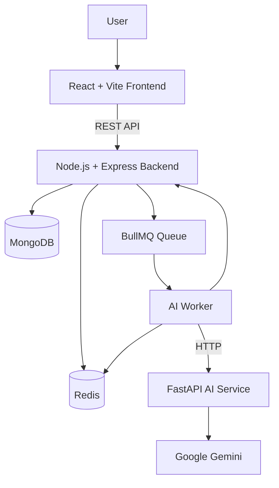
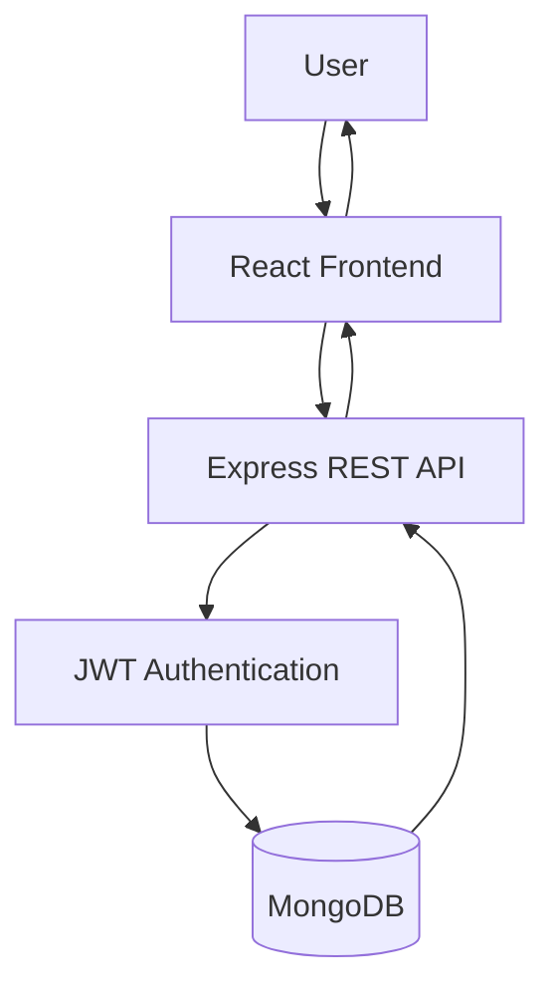
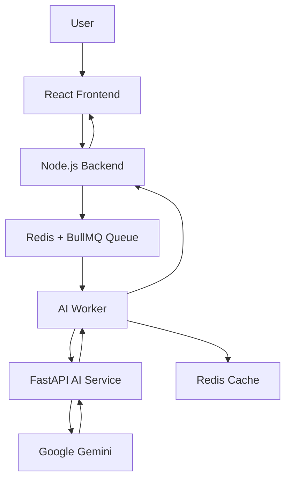
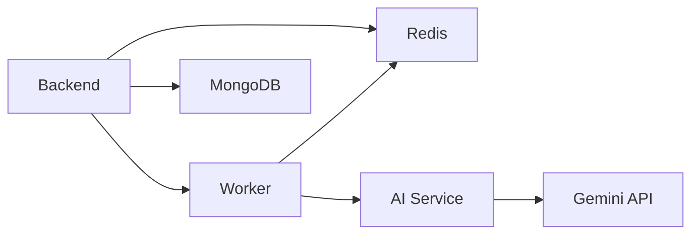

# AI Flashcard Generator

An AI-powered flashcard generation platform that allows users to create study flashcards from text, PDF documents, and YouTube videos. The application combines a React frontend, Node.js backend, Python AI service, Gemini, Redis, and BullMQ to provide asynchronous AI-powered flashcard generation.

The platform also includes user authentication, deck management, spaced repetition, AI-generated flashcards, caching, background job processing, and Docker-based deployment.

---

## Features

* User registration and login
* JWT-based authentication
* Protected API routes
* Flashcard deck creation and management
* Flashcard creation, update, deletion, and retrieval
* Bulk flashcard creation
* Flashcard review system
* Spaced repetition scheduling
* Difficulty levels:

  * `easy`
  * `medium`
  * `hard`
* Flashcard tagging
* AI-powered flashcard generation
* Generate flashcards from plain text
* Generate flashcards from PDF documents
* Generate flashcards from YouTube videos
* Asynchronous AI generation using BullMQ
* Redis-backed job queue
* Dedicated background worker for AI generation
* Job status and progress tracking
* Automatic AI job retries with exponential backoff
* Redis-based AI response caching
* AI response validation and normalization
* Duplicate flashcard detection
* Configurable number of generated flashcards
* Structured logging using Pino
* Request ID tracking
* Authentication header redaction in logs
* API rate limiting
* MongoDB database
* RESTful API architecture
* Dockerized backend services
* Docker Compose orchestration
* Separate AI service
* FastAPI-based AI microservice
* Gemini-powered flashcard generation
* Automated backend and AI-service tests
* Production-oriented error handling and validation

---

# Architecture



The application is divided into three main application components:

```text
Frontend
    ↓
Node.js Backend
    ↓
Redis + BullMQ
    ↓
AI Worker
    ↓
FastAPI AI Service
    ↓
Gemini
```

MongoDB is used by the backend for persistent application data.

---

# Request Flow

## Normal Application Request



Normal operations such as authentication, deck management, flashcard management, and reviews are handled directly by the Node.js backend.

---

# AI Generation Flow

AI generation is handled asynchronously so that long-running AI requests do not block the main backend request.



The initial API request returns a job ID instead of waiting for AI generation to finish.

Example:

```json
{
  "jobId": "1",
  "status": "queued"
}
```

The client can then query the job status.

---

# Asynchronous Job Processing

The AI generation pipeline uses **BullMQ** with Redis.

```text
User Request
     ↓
POST /api/ai/generate/text
     ↓
Create BullMQ Job
     ↓
Redis
     ↓
AI Worker
     ↓
FastAPI AI Service
     ↓
Gemini
     ↓
Generated Flashcards
     ↓
Cache Result
     ↓
Job Completed
```

The worker processes AI jobs independently from the API server.

This allows AI generation to run in the background while the API remains responsive.

---

# Job Lifecycle

A job can move through states such as:

```text
queued
   ↓
processing
   ↓
completed
```

If AI generation fails:

```text
processing
   ↓
failed
   ↓
retry
   ↓
processing
```

The application configures:

```text
Attempts: 3
Backoff: Exponential
Initial delay: 2000ms
```

Completed and failed jobs are automatically cleaned up according to configured retention policies.

---

# AI Worker

The dedicated worker consumes jobs from the `ai-generation` queue.

Supported job types are:

```text
text
pdf
youtube
```

The worker:

1. Receives the queued job.
2. Updates job progress.
3. Calls the appropriate AI service endpoint.
4. Receives generated flashcards.
5. Stores the generated response in Redis cache.
6. Updates the job to completed.
7. Returns the generated result.

The worker supports configurable concurrency through:

```text
AI_WORKER_CONCURRENCY
```

---

# AI Service

The AI service is implemented using **FastAPI** and runs independently from the Node.js backend.

The service provides AI generation functionality for:

```text
Text
PDF
YouTube
```

The service communicates with Google Gemini for flashcard generation.

Health check:

```text
GET /health
```

Example response:

```json
{
  "status": "ok",
  "service": "AI Flashcard Generator"
}
```

---

# AI Flashcard Generation

The AI service generates structured flashcards containing:

```json
{
  "question": "...",
  "answer": "...",
  "difficulty": "medium",
  "tags": ["..."]
}
```

The generation process supports configurable:

```text
difficulty
count
source content
```

The resulting response also includes information such as:

```text
topic
summary
count
flashcards
```

---

# AI Response Validation

AI output is not accepted blindly.

The AI service validates and normalizes the generated response before returning it.

Validation includes:

* Required flashcard fields
* Flashcard structure
* Difficulty validation
* Requested flashcard count
* Duplicate detection
* Normalization of generated content

If the AI returns fewer unique flashcards than requested, the service raises an error instead of silently returning an incomplete result.

For example:

```text
Requested: 3

Generated:
1. Card A
2. Card B
3. Card C

Result:
Valid
```

If only two unique cards are available:

```text
Requested: 3

Generated:
1. Card A
2. Card B

Result:
Validation Error
```

---

# Redis Caching

Redis is used for both:

* BullMQ job processing
* AI response caching

The worker caches successfully generated AI results.

Conceptually:

```text
AI Request
    ↓
Generate Cache Key
    ↓
Check/Use Redis Cache
    ↓
AI Generation
    ↓
Store Result
```

This reduces unnecessary repeated AI generation for equivalent requests.

Cache entries use a configurable expiration period.

---

# Spaced Repetition System

The application includes a spaced repetition system for reviewing flashcards.

Each flashcard maintains values such as:

```text
easeFactor
interval
repetitions
lastReviewDate
reviewCount
nextReviewDate
```

Users submit a review rating:

```text
again
hard
good
easy
```

The system calculates the next review interval based on the review result.

Example:

```json
{
  "srsResult": {
    "easeFactor": 2.5,
    "interval": 1,
    "repetitions": 1,
    "nextReviewDate": "..."
  },
  "message": "Review recorded"
}
```

---

# Flashcard Management

Flashcards belong to a deck and are associated with the authenticated user.

Each flashcard contains information such as:

```text
deckId
userId
question
answer
difficulty
tags
easeFactor
interval
repetitions
lastReviewDate
reviewCount
nextReviewDate
```

Supported operations include:

```text
Create
Read
Update
Delete
Bulk Create
Review
```

---

# Deck Management

Users can create and manage flashcard decks.

A deck contains:

```text
userId
name
description
tags
cardCount
dueCount
createdAt
updatedAt
```

Deck functionality includes:

```text
Create deck
Get decks
Get individual deck
Update deck
Delete deck
Dashboard statistics
```

---

# Authentication

The backend provides JWT-based authentication.

Authentication endpoints include:

```text
POST /api/auth/signup
POST /api/auth/login
GET  /api/auth/me
```

Protected endpoints require:

```text
Authorization: Bearer <JWT>
```

User-specific resources are associated with the authenticated user ID.

---

# API Endpoints

## Authentication

```text
POST /api/auth/signup
POST /api/auth/login
GET  /api/auth/me
```

---

## Decks

```text
GET    /api/decks
GET    /api/decks/:id
POST   /api/decks
PUT    /api/decks/:id
DELETE /api/decks/:id

GET    /api/decks/stats/dashboard
```

---

## Flashcards

```text
GET    /api/flashcards
POST   /api/flashcards
POST   /api/flashcards/bulk
PUT    /api/flashcards/:id
DELETE /api/flashcards/:id

POST   /api/flashcards/:id/review
```

---

## AI Generation

```text
POST /api/ai/generate/text
POST /api/ai/generate/pdf
POST /api/ai/generate/youtube

GET  /api/ai/job/:id
```

---

# Example AI Request

```http
POST /api/ai/generate/text
```

Request:

```json
{
  "text": "Docker is a platform for building and running applications in containers.",
  "difficulty": "medium",
  "count": 3
}
```

Immediate response:

```json
{
  "jobId": "1",
  "status": "queued"
}
```

The client can then request:

```http
GET /api/ai/job/1
```

Completed response:

```json
{
  "jobId": "1",
  "status": "completed",
  "progress": 100,
  "result": {
    "flashcards": [],
    "topic": "Docker and Containerization",
    "summary": "...",
    "count": 3
  },
  "failedReason": null,
  "attemptsMade": 1
}
```

---

# Error Handling and Retries

The AI pipeline uses retry handling for transient failures.

BullMQ jobs are configured with:

```text
3 attempts
Exponential backoff
```

This provides resilience against temporary AI-service or network failures.

The job status exposes:

```text
progress
status
failedReason
attemptsMade
result
```

---

# Logging and Observability

The backend uses structured logging through **Pino**.

Logs include structured information such as:

```text
requestId
jobId
operation
errors
status
```

Authentication headers are redacted from logs.

Example request information can be correlated using the generated request ID.

This makes debugging distributed requests across the API, queue, worker, and AI service easier.

---

# Security

The application uses several security mechanisms:

* JWT authentication
* Protected API routes
* User-scoped decks
* User-scoped flashcards
* Input validation
* AI output validation
* API rate limiting
* Authentication header redaction
* Docker service isolation
* Separate AI microservice
* Background job processing
* Controlled AI retry behavior

The worker and AI service communicate using Docker's internal service network.

The AI service is accessed internally using:

```text
http://ai_service:8000
```

rather than relying on `localhost` from inside the worker container.

---

# Docker Architecture

The application uses Docker Compose to run its infrastructure.



Services:

```text
backend
worker
ai_service
redis
mongo
```

The verified Docker setup runs:

```text
Backend       → 5000
AI Service    → 8000
MongoDB       → 27017
Redis         → 6379
Worker        → Background service
```

---

# Docker Compose

Start the complete application:

```bash
docker compose up -d --build
```

Check running services:

```bash
docker compose ps
```

View logs:

```bash
docker compose logs -f
```

View worker logs:

```bash
docker compose logs -f worker
```

View AI service logs:

```bash
docker compose logs -f ai_service
```

Stop services:

```bash
docker compose down
```

---

# Project Structure

```text
AI-Flashcard-Generator/
│
├── frontend/
│   ├── src/
│   ├── public/
│   ├── package.json
│   ├── package-lock.json
│   └── vite.config.*
│
├── backend/
│   ├── src/
│   │   ├── config/
│   │   ├── controllers/
│   │   ├── jobs/
│   │   ├── middleware/
│   │   ├── models/
│   │   ├── routes/
│   │   ├── services/
│   │   ├── tests/
│   │   ├── index.ts
│   │   └── worker.ts
│   │
│   ├── package.json
│   ├── tsconfig.json
│   └── Dockerfile
│
├── ai_service/
│   ├── tests/
│   ├── services/
│   ├── main.py
│   ├── requirements.txt
│   └── Dockerfile
│
├── docker-compose.yml
├── .env.example
├── .gitignore
└── README.md
```

---

# Environment Variables

The application uses environment variables for configuration and secrets.

Example:

```env
# Backend
PORT=5000
MONGO_URL=mongodb://mongo:27017/ai_flashcards
REDIS_URL=redis://redis:6379
AI_SERVICE_URL=http://ai_service:8000

# Authentication
JWT_SECRET=your_jwt_secret

# AI Service
GEMINI_API_KEY=your_gemini_api_key

# Worker
AI_WORKER_CONCURRENCY=2
```

Do not commit `.env` files or API keys to GitHub.

---

# Setup

## 1. Clone the repository

```bash
git clone https://github.com/radhey004/AI-Flashcard-Generator.git
cd AI-Flashcard-Generator
```

---

## 2. Configure Environment Variables

Create your environment configuration from the provided example:

```bash
cp .env.example .env
```

Configure the required MongoDB, Redis, JWT, and Gemini values.

---

# 3. Run with Docker

Build and start the complete application:

```bash
docker compose up -d --build
```

Check containers:

```bash
docker compose ps
```

The backend should be available at:

```text
http://localhost:5000
```

The AI service should be available at:

```text
http://localhost:8000
```

---

# 4. Run Frontend

For local frontend development:

```bash
cd frontend
npm install
npm run dev
```

---

# Testing

## AI Service Tests

From the project root:

```bash
python -m pytest -q ai_service/tests
```

The AI service test suite covers validation and AI-service behavior.

---

## Backend Tests

```bash
cd backend
npm test -- --detectOpenHandles
```

---

## Backend Build

```bash
npm run build
```

---

## Frontend Build

```bash
cd frontend
npm run build
```

---

# Verified Docker Flow

The Docker deployment has been tested through the complete AI generation pipeline:

```text
POST /api/ai/generate/text
        ↓
BullMQ Job Created
        ↓
Redis
        ↓
AI Worker
        ↓
FastAPI AI Service
        ↓
Gemini
        ↓
3 Flashcards Generated
        ↓
Job Progress = 100
        ↓
Job Status = completed
```

Example successful job response:

```json
{
  "jobId": "1",
  "status": "completed",
  "progress": 100,
  "attemptsMade": 1
}
```

---

# Database

MongoDB stores application data including:

```text
Users
Decks
Flashcards
```

Flashcard documents maintain spaced-repetition state and review information.

The backend uses Mongoose for MongoDB data access.

---

# Technology Stack

| Layer                  | Technology     |
| ---------------------- | -------------- |
| Frontend               | React.js       |
| Language               | TypeScript     |
| Build Tool             | Vite           |
| Backend                | Node.js        |
| API Framework          | Express.js     |
| Backend Language       | TypeScript     |
| Database               | MongoDB        |
| ODM                    | Mongoose       |
| AI Service             | FastAPI        |
| AI Language            | Python         |
| LLM                    | Google Gemini  |
| Job Queue              | BullMQ         |
| Message Broker / Cache | Redis          |
| Authentication         | JWT            |
| Logging                | Pino           |
| Testing                | Jest / Pytest  |
| Containerization       | Docker         |
| Orchestration          | Docker Compose |

---

# Production-Oriented Design

The project separates synchronous API operations from long-running AI workloads.

Instead of:

```text
Client
  ↓
Backend
  ↓
AI Generation
  ↓
Response
```

the application uses:

```text
Client
  ↓
Backend
  ↓
Queue
  ↓
Immediate Job ID
```

and:

```text
Worker
  ↓
AI Service
  ↓
Gemini
  ↓
Result
```

This architecture provides:

* Non-blocking AI generation
* Independent worker scaling
* Retry handling
* Queue-based workload management
* Redis caching
* Service separation
* Better fault isolation

---

# Current Limitations

* AI-generated flashcards depend on the availability and response quality of the configured Gemini model.
* YouTube and PDF generation depend on successful extraction/processing of the supplied source.
* AI generation requires a valid Gemini API key.
* Large frontend bundles may require additional code-splitting optimization for production deployments.

---

# Project Goal

The project demonstrates how an AI-powered learning platform can be designed using a distributed application architecture.

The primary workflow is:

```text
User
 ↓
React Frontend
 ↓
Node.js REST API
 ↓
Redis + BullMQ
 ↓
Background Worker
 ↓
FastAPI AI Service
 ↓
Gemini
 ↓
Validated Flashcards
 ↓
Redis Cache
 ↓
User
```

Alongside AI generation, the platform provides:

```text
Authentication
     ↓
Deck Management
     ↓
Flashcard Management
     ↓
Spaced Repetition
     ↓
Review Tracking
```

The implementation combines React, TypeScript, Node.js, Express, MongoDB, FastAPI, Gemini, Redis, BullMQ, Docker, and spaced-repetition logic into a full-stack AI learning application.
